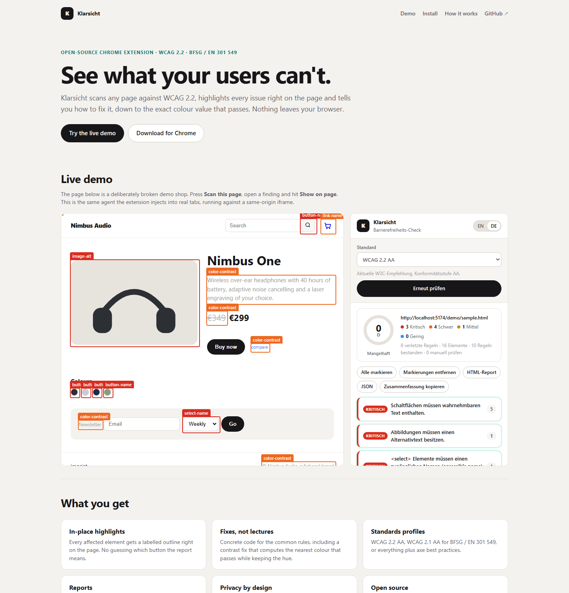
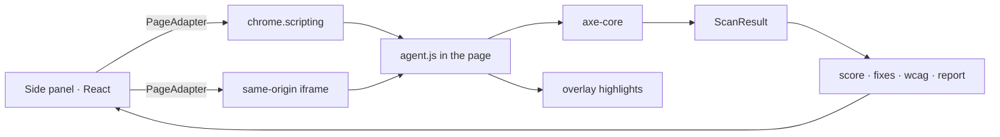

# Klarsicht

**See what your users can't.** Klarsicht is an open-source Chrome extension that scans any page against WCAG 2.2, highlights every issue right on the page and tells you how to fix it, down to the exact colour value that passes. Nothing leaves your browser.

[](https://github.com/malzinger/klarsicht/actions/workflows/ci.yml)

**Live demo:** https://malzinger.github.io/klarsicht/ · **Download:** [latest release](https://github.com/malzinger/klarsicht/releases/latest) · **Stack:** TypeScript, React 19, Manifest V3, axe-core, Vite 8, Vitest



## What it does

- **In-place highlights.** Every affected element gets a labelled outline on the page itself, so there is no guessing which of twelve buttons the report means.
- **Fixes, not lectures.** Concrete code for the common rules. The contrast fix computes the nearest colour that passes the required ratio while keeping the hue, using the same maths the WCAG formula uses.
- **Standards profiles.** WCAG 2.2 AA, WCAG 2.1 AA for BFSG / EN 301 549 (the German Accessibility Strengthening Act), or everything plus axe best practices.
- **Reports.** Self-contained HTML report, JSON for pipelines, a text summary for the ticket. Rule texts in English or German, including the engine's own German locale.
- **Score.** 100 minus a penalty per failing rule, weighted by impact and scaled logarithmically by affected elements. Grades A to D.
- **Privacy by design.** `activeTab` by default, so a tab is only touched after you click the icon on it. Optionally grant host access once to scan any tab directly. No network calls, no analytics.

## Install

1. Download `klarsicht-extension.zip` from the [latest release](https://github.com/malzinger/klarsicht/releases/latest) and unpack it.
2. Open `chrome://extensions`, enable **Developer mode**.
3. **Load unpacked**, pick the unpacked folder.
4. Open any page, click the Klarsicht icon to open the side panel, then **Scan this page**.

Chrome 116 or newer; works in Edge and Brave too. A Web Store listing is on the roadmap.

## How it works



The side panel never touches a page directly. A `PageAdapter` injects a classic script, the agent, and exchanges plain data with it. The extension adapter uses `chrome.scripting.executeScript`; the landing page swaps in an adapter that drives a same-origin iframe. Scanning, highlighting, scoring, fixes and reports are shared line for line, which is also what makes the demo honest: it runs the real thing.

| Area       | Where                | Notes                                                                                                 |
| ---------- | -------------------- | ----------------------------------------------------------------------------------------------------- |
| Engine     | `axe-core`           | Same rules Lighthouse uses; the German locale ships with it                                           |
| Page agent | `src/agent/agent.ts` | Runs axe, serialises findings, draws overlays; bundled as an IIFE                                     |
| Adapters   | `src/adapters/`      | `extension.ts` and `iframe.ts` behind one interface                                                   |
| Core       | `src/core/`          | Pure TypeScript: colour maths, scoring, fix templates, WCAG mapping, reports, i18n. Fully unit-tested |
| UI         | `src/ui/`            | Panel, finding cards, score ring, landing page                                                        |

### Scoring

Score = 100 − Σ weight(impact) × (1 + log₂ elements), clamped at 0. Weights: critical 10, serious 5, moderate 2, minor 1. One critical rule on one element costs 10 points, on eight elements 40. A ≥ 95, B ≥ 80, C ≥ 60, otherwise D. The formula lives in `src/core/score.ts` with tests.

## Development

```bash
npm install
npm run dev        # landing page + live demo on http://localhost:5173
npm run build      # typecheck, bundle agent + service worker, build dist/
npm run pack       # dist/ → klarsicht-extension.zip
npm test           # Vitest: colour maths, scoring, WCAG mapping, fixes, reports
npm run lint       # ESLint with the React Compiler rules
```

`dist/` is both the unpacked extension and the static site. CI runs lint, format check, typecheck, tests, build and pack on every push, deploys the landing page to GitHub Pages from `main`, and attaches the zip to a GitHub release for every `v*` tag.

## Roadmap

- Chrome Web Store listing and a Firefox port (the agent is plain DOM code, only the adapter differs)
- CLI mode: the same agent run headlessly with Playwright for CI gates
- Diff two scans to show what a deploy changed
- Optional AI explanations for the long tail of rules without a template

## License

MIT. Klarsicht is built on [axe-core](https://github.com/dequelabs/axe-core) (MPL 2.0), which stays untouched in `axe.min.js`.
